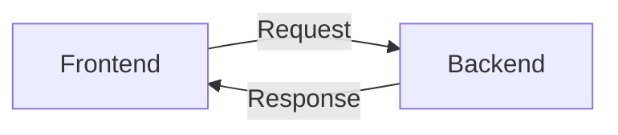

# 🌐 Comunicación en Redes para Desarrollo Web
Trabajo en equipo desarrollado por Zuelem Chañillao, Cristián Diaz, Natalia Medel, Sary Viafara y Alexander Hass


> 📘 Documento completo que explica los fundamentos de redes aplicados al desarrollo web, manteniendo tanto la intuición como el nivel técnico.

---

## 📑 Tabla de Contenidos

* [Conceptos Base](#-conceptos-base)
* [TCP vs UDP](#️-tcp-vs-udp)
* [Puertos](#-puertos)
* [HTTP](#-http)
* [Conexión con desarrollo](#-conexión-con-desarrollo)
* [Problemas reales](#-problemas-reales)
* [Caso práctico](#-caso-práctico)
* [Analogías](#-analogías)
* [Bonus](#-bonus)

---

## 📚 1 Conceptos Base

| Concepto   | Definición simple                                                                                     | Nivel técnico breve                                                                                  | Ejemplo real                                                         |
| ---------- | ----------------------------------------------------------------------------------------------------- | ---------------------------------------------------------------------------------------------------- | -------------------------------------------------------------------- |
| **TCP**    | Un método de envío de datos muy seguro que verifica que todo el contenido llegue completo y en orden. | Protocolo orientado a conexión que garantiza la entrega de paquetes mediante confirmaciones (ACKs).  | Enviar un correo electrónico o descargar un archivo.                 |
| **UDP**    | Un método de envío súper rápido que lanza la información sin detenerse a revisar si llegó completa.   | Protocolo sin conexión que no garantiza la entrega de paquetes; prioriza velocidad sobre fiabilidad. | Una videollamada donde si se pierde un fotograma, el video continúa. |
| **Puerto** | Una "puerta" numerada que indica qué aplicación recibe datos.                                         | Punto final lógico de red asociado a un proceso.                                                     | Puerto 80 (web), puerto 25 (correo).                                 |
| **HTTP**   | Reglas que usan navegador y servidor para comunicarse.                                                | Protocolo de aplicación basado en request-response.                                                  | Añadir productos a un carrito.                                       |

---

## ⚙️ 2 TCP vs UDP

¿Cuál es la principal diferencia entre TCP y UDP? 
La diferencia fundamental es que TCP es un protocolo orientado a la conexión, lo que significa que establece un canal de comunicación formal antes de enviar datos. UDP es un protocolo sin conexión, por lo que simplemente envía los datos hacia el destino sin verificar si el receptor está listo o si los paquetes llegaron.

¿Cuál es más confiable? ¿Por qué? 
TCP es más confiable. Esto se debe a que realiza un seguimiento de todos los paquetes enviados, verifica si hay errores, ordena los paquetes que llegan desordenados y solicita automáticamente la retransmisión de cualquier paquete que se haya perdido en el camino.

¿Cuál es más rápido? ¿Por qué? 
UDP es más rápido. Al no tener que establecer una conexión previa (el famoso handshake o saludo a tres vías), no requerir acuses de recibo (ACKs) por cada paquete y no perder tiempo retransmitiendo datos perdidos, UDP tiene una sobrecarga mucho menor y transmite la información casi instantáneamente.


### 🔑 Diferencia principal

* **TCP** es orientado a conexión → establece comunicación antes de enviar datos
* **UDP** es sin conexión → envía datos sin verificar estado del receptor

---

### 🛡️ ¿Cuál es más confiable?

**TCP es más confiable porque:**

* Hace seguimiento de paquetes
* Detecta errores
* Reordena paquetes
* Retransmite pérdidas automáticamente

---

### ⚡ ¿Cuál es más rápido?

**UDP es más rápido porque:**

* No handshake
* No ACKs
* No retransmisión
* Menor sobrecarga

---

### 📊 Comparación

| Protocolo | Característica clave          | Uso típico                   |
| --------- | ----------------------------- | ---------------------------- |
| TCP       | Conexión, confiable, ordenado | HTTP, HTTPS, SMTP, FTP       |
| UDP       | Rápido, sin garantía          | Streaming, juegos, VoIP, DNS |

---


## 🚪 3 Puertos

### 📌 ¿Qué es un puerto?
Un puerto es un número que identifica una aplicación específica dentro de un equipo en una red.
 Piensa en tu computadora como un edificio:
IP → dirección del edificio
Puerto → número de departamento o puerta
Sin puerto, los datos no sabrían a qué programa entregar la información.

### 🤔 ¿Por qué una aplicación necesita un puerto?

* Para diferenciar varias aplicaciones que usan la misma red.
* Cada app “escucha” en su puerto para recibir solicitudes.
* Permite que varias conexiones ocurran al mismo tiempo sin confundirse.

---

### 🔢 Puertos comunes

| Puerto | Uso        |
| ------ | ---------- |
| 80     | HTTP       |
| 443    | HTTPS      |
| 3000   | Desarrollo |
| 5000   | Backend    |
| 5432   | PostgreSQL |
| 22     | SSH        |

---

### 💻 Ejemplo desarrollador
¿Qué pasa cuando ejecutas?

```bash
npm run dev
```
Cuando ejecutas npm run dev, se inicia un servidor local en tu computador que utiliza un puerto específico (como el 3000). Luego, puedes acceder a la aplicación desde el navegador usando localhost:3000, donde ese puerto le indica al sistema a qué aplicación debe enviar los datos. En resumen:
* Se levanta un servidor local (ej: localhost:3000).
* Tu app queda “escuchando” en ese puerto.
* Puedes acceder desde el navegador.


## 🌐 4 HTTP

### 📖 ¿Qué es?

Es el protocolo que permite que el navegador y el servidor se comuniquen.

---

### ⚙️ ¿Cómo funciona?

* El cliente envía una petición
* El servidor responde
* Viaja en texto plano (no seguro)

---

### 📩 Métodos HTTP

| Método | Acción        |
| ------ | ------------- |
| GET    | Obtener datos |
| POST   | Enviar datos  |
| PUT    | Actualizar    |
| DELETE | Eliminar      |

---

### 🔄 Flujo



---

## 🔗 5 Conexión con desarrollo

### Ejemplo real

```js
fetch("http://localhost:3000/api")
```

### 📌 Explicación completa

* **Protocolo:** HTTP
* **Puerto:** 3000
* **Tipo:** Cliente → Servidor

👉 El frontend pide datos al backend local
👉 Indica a qué programa hablar mediante el puerto

---

### 🔐 HTTP vs HTTPS

* `http://` → no seguro
* `https://` → seguro (cifrado)

Puertos:

* 80 → HTTP
* 443 → HTTPS

---

## ❗ 6 Problemas reales

### 🚨 Errores

#### Port already in use

* El puerto ya está ocupado
  ✔️ Solución:
* Cerrar proceso
* Cambiar puerto

---

#### Connection refused

* Servidor no activo
  ✔️ Solución:
* Verificar backend

---

#### Timeout

* Servidor no responde
  ✔️ Solución:
* Revisar red
* Optimizar backend

---

### 🔍 Qué revisar

* Servidor corriendo
* Puerto correcto
* URL correcta
* Firewall/red
* Configuración backend

---

## 🌍 7 Caso práctico

### ❌ Frontend no conecta

---

### 🔌 Problema de puerto

Frontend y backend usan puertos distintos.

✔️ Solución:
Verificar `baseURL`

---

### 🔒 Problema de protocolo (explicación completa)

Si el frontend está en HTTPS y el backend en HTTP:

👉 El navegador bloquea la conexión (Mixed Content)

**Analogía:**
Es como intentar entrar a un banco seguro con un paquete no verificado.

✔️ Solución:

* Usar HTTPS en ambos
* Configurar proxy

---

### 🌐 Problema de red

Puede ser:

* IP incorrecta
* Servidor caído
* CORS

✔️ Solución:

* Revisar endpoint
* Configurar CORS

---

## 🧪 8 Analogías

| Concepto | Analogía              |
| -------- | --------------------- |
| TCP      | Envío certificado   El cartero entrega el paquete en mano, firmas el recibí y, si algo llega roto, se vuelve a enviar hasta que esté perfecto.|
| UDP      | Panfletos desde avión Se envían rápido y en masa; no importa si algunos caen en un techo o se los lleva el viento, lo que cuenta es la velocidad.|
| Puerto   | Puertas de un mall  El edificio (IP) es el mismo, pero entras por la "Puerta 80" para ropa o por la "Puerta 443" para tecnología.|
| HTTP     | Formulario de pedido Es el documento estándar que rellenas (con campos como "Nombre", "Pedido", "Dirección") para que el dependiente entienda exactamente qué quieres.|

---

## 🧠 Bonus

### 🔐 HTTPS

Versión segura de HTTP con cifrado SSL/TLS.

---

### 🧩 REST

Arquitectura basada en métodos HTTP:

* GET
* POST
* PUT
* DELETE

---

### 🎯 Endpoint

Es la URL específica donde se hacen peticiones:

```
https://api.com
```

---

## 🚀 Conclusión

Este documento integra teoría + práctica sobre:

* Protocolos de red
* Puertos
* HTTP
* Comunicación cliente-servidor
* Problemas reales de desarrollo
